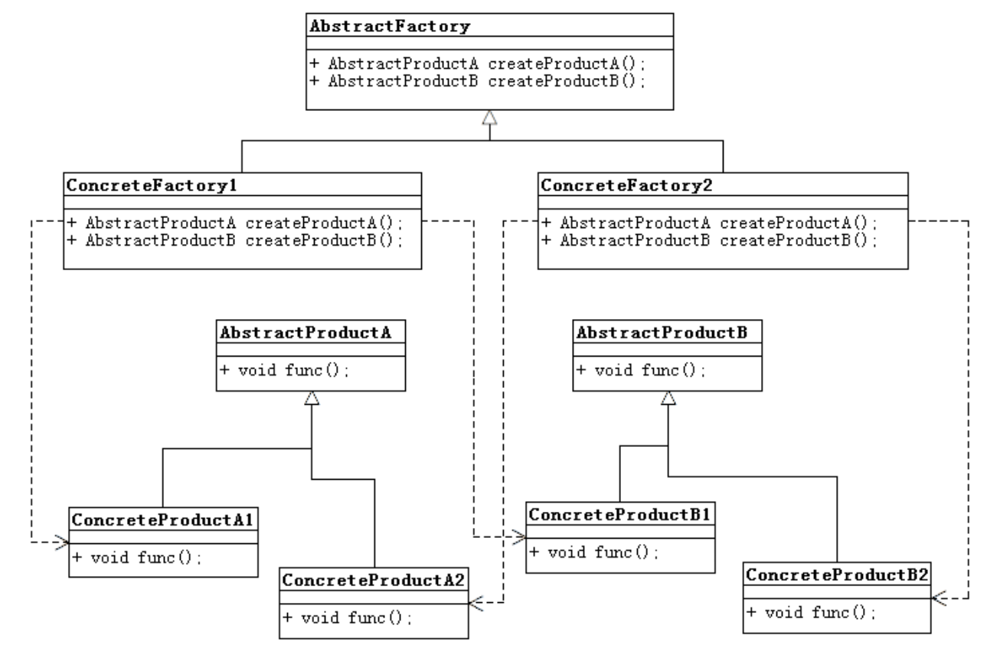

# Abstract Factory Pattern

## 使用场景
### 比如说Android、iOS以及Window Phone下都有短信软件以及拨号软件，那么这两款软件就都是Software的范畴，但是它们又是出自不同的公司。
* 我们把两款软件抽象成为产品 SoftwareA 和 SoftwareB。
* 把几家公司抽象成为工厂 AbstractFactory，其可以生产SoftwareA 和 SoftwareB，那么我们就可以得到下面的类图。

## 抽象工厂模式类图

## 和工厂模式的比较
### 抽象工厂模式具体的产品类和具体工厂类都需要操作者去实现，而工厂模式工厂类不需要实现，只需要实现具体的产品类即可。注意：抽象工厂抽象在于产品还未确定还是抽象的。

## 模式使用Demo
* [Abstract Factory Pattern Demo](./AbstractFactoryPattern)