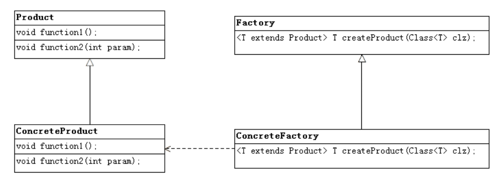

# FactoryPattern

## 工厂模式类图

## 使用场景
### 1.Set和List集合的迭代其就是使用了工厂模式，不同的实现有不同的迭代器实现。
* 产品就是具体的迭代器。

## 模式使用Demo
* [Factory Pattern Demo](https://github.com/halohoop/Halohoop_Code_Schools_New/tree/android_java_design_patterns/Design_Patterns/factory_pattern/FactoryPattern)